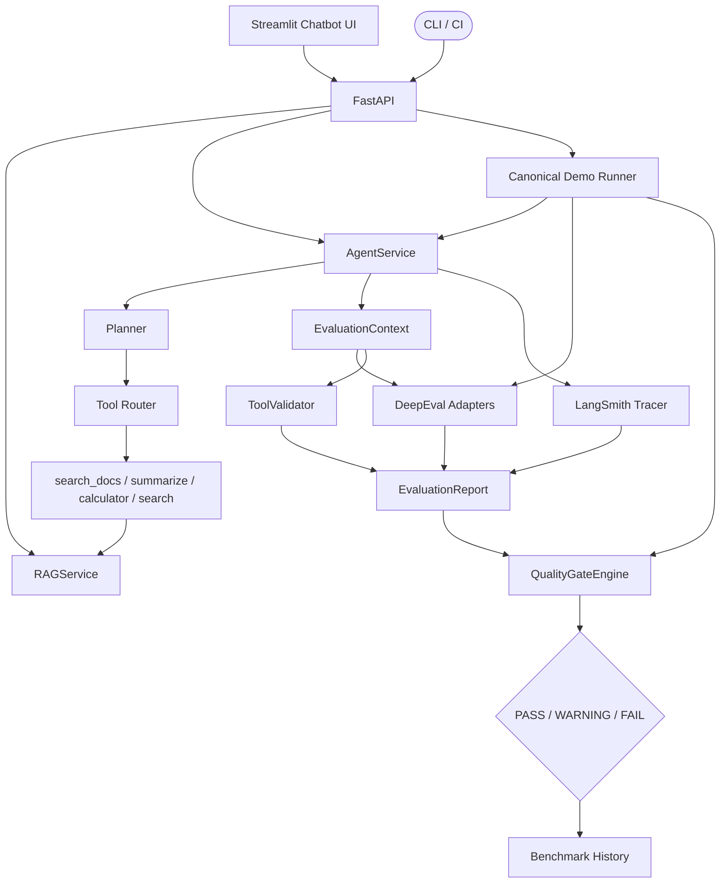
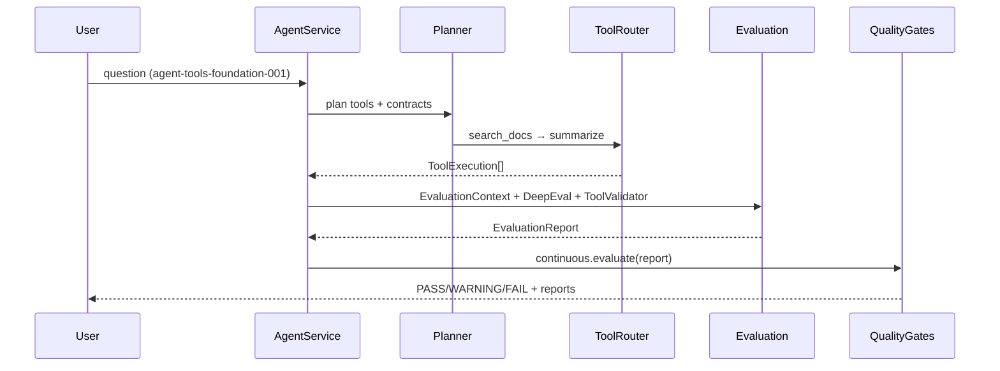
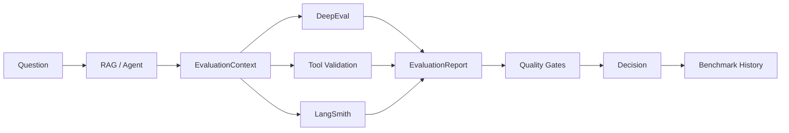
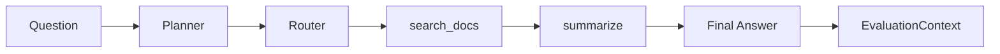

# Buddie — Agentic RAG & Evaluation Platform

**Version 1.0.0** — Production-oriented platform for building, tracing, and gatekeeping Retrieval-Augmented Generation (RAG) and tool-using agents.

Clone → `make setup` → `make demo` → LangGraph, LangSmith, DeepEval, tool validation, quality gates, and reports — **no API keys required** for the offline demo.

---

## Project Overview

This is not a chatbot toy. It is an **AI evaluation platform**: a layered RAG pipeline, a LangGraph agent that treats RAG as tools, and a continuous evaluation stack that decides **PASS / WARNING / FAIL** using configurable quality gates.

| Layer | Responsibility |
|-------|----------------|
| Ingestion → Embeddings → Vector Store → Retrieval → Generation | Classic RAG pipeline |
| Orchestration (`RAGService`) | Single use-case workflow |
| LangGraph Agent | Planner → Router → Tools |
| Evaluation | DeepEval + Tool Validation + LangSmith |
| Quality Gates | Release policy + regression + benchmark history |

---

## Features

- **Production RAG pipeline** with Strategy abstractions (loaders, chunkers, embeddings, vector store, retriever, LLM)
- **LangGraph agent** with planner, tool router, and contracts (`search_docs`, `summarize`, `calculator`, `search`)
- **DeepEval adapters** behind a vendor-neutral `Metric` interface
- **LangSmith tracing** behind a `Tracer` ABC (`NoOpTracer` when disabled)
- **Tool validation** (expected vs actual tools, args, order)
- **Quality gates** with actionable recommendations
- **Benchmark history** and regression detection
- **One-command demo** (`make demo`) and **Docker** packaging
- **GitHub Actions** for lint, tests, evaluation, benchmarks, quality gates, and image builds

---

## Quick Start

```bash
git clone https://github.com/hacky-ghostrider/buddie.git
cd buddie

# Install (uv preferred)
make setup

# Offline demo — no API keys
make demo
```

Artifacts land in `data/demo/` (evaluation JSON/CSV/HTML, quality report, benchmark).

### Chatbot UI (Streamlit)

Thin presentation layer over FastAPI — no RAG/agent/evaluation logic in the UI.

```bash
# Terminal 1 — backend
uv run uvicorn app.main:app --reload --port 8000
# or: make api

# Terminal 2 — Streamlit UI
uv run streamlit run frontend/app.py
# or: make ui
```

Open the Streamlit URL (default `http://localhost:8501`). Use **RAG** / **AGENT** modes,
**Run Demo** for `agent-tools-foundation-001`, and the Debug / Evaluation / LangSmith panels.

Walkthrough: [docs/demo/chatbot-demo.md](docs/demo/chatbot-demo.md)

Optional live mode (requires keys in `.env`):

```bash
cp .env.example .env   # set OPENAI_API_KEY, optionally LANGSMITH_API_KEY
python scripts/demo.py --live
```

---

## Installation

**Requirements:** Python 3.12+, [uv](https://github.com/astral-sh/uv) (recommended) or pip, GNU Make.

```bash
make setup
# or
uv sync --extra dev && uv pip install -e ".[dev]"
# or
pip install -e ".[dev]"
```

Run the API:

```bash
uv run uvicorn app.main:app --reload --port 8000
# Health: GET http://localhost:8000/health
# RAG:    POST /api/v1/rag/query
# Agent:  POST /api/v1/agent/query
# Demo:   POST /api/v1/demo/run
# Reports: GET /api/v1/reports
```

Run the Streamlit chatbot:

```bash
uv run streamlit run frontend/app.py
```

Docker:

```bash
make docker
docker compose up --build
# MCP HTTP: BUDDIE_TOOL_MODE=mcp MCP_TRANSPORT=http docker compose up --build
# Legacy API: docker compose --profile legacy up api
# Dev hot-reload: docker compose --profile dev up
# Prod-like:      docker compose --profile prod up -d
```

---

## Configuration

Copy `.env.example` → `.env`. Important variables:

| Variable | Purpose |
|----------|---------|
| `OPENAI_API_KEY` | Live generation (**backend only**) |
| `CHROMA_PERSIST_DIRECTORY` | Persistent vector store path |
| `ENABLE_LANGSMITH` / `LANGSMITH_API_KEY` | Live traces (**backend only**) |
| `ENABLE_DEEPEVAL` | Register DeepEval metrics |
| `QUALITY_GATE_ENABLED` | Master quality-gate switch |
| `MIN_FAITHFULNESS`, `MAX_HALLUCINATION`, … | Gate thresholds |
| `PASS_THRESHOLD` / `WARNING_THRESHOLD` | Overall score bands |
| `REPORT_DIRECTORY` / `QUALITY_REPORT_DIRECTORY` | Artifact paths |
| `API_BASE_URL` | Streamlit → FastAPI base URL |
| `STREAMLIT_PORT` | Local Streamlit port |

Full list: [`.env.example`](.env.example).

**Do not put API keys in the Streamlit app.** The frontend only needs `API_BASE_URL`.

---

## Chatbot UI

```text
Browser
   ↓
Streamlit (frontend/)
   ↓
FastAPI (/api/v1/rag|agent|demo|reports)
   ↓
RAGService / AgentService / Canonical Demo Runner
   ↓
DeepEval · Tool Validation · LangSmith · Quality Gates
```

| Mode / Panel | What you see |
|--------------|--------------|
| **RAG** | Answer + retrieved docs / latency via Debug |
| **AGENT** | Final answer + planner / tool flow |
| **Debug** | Model, latency, chunks, tools, correlation / trace ids |
| **Evaluation** | DeepEval metrics, tool validation, quality gate (esp. after Run Demo) |
| **LangSmith Trace** | Trace / run ids + clickable URL from backend metadata |
| **Reports** | View existing JSON/CSV/HTML under `data/` / `data/demo/` |
| **Run Demo** | Full `agent-tools-foundation-001` pipeline |

Screenshots: add local captures under `docs/demo/screenshots/` (placeholder).

Interview demo flow: [docs/demo/chatbot-demo.md](docs/demo/chatbot-demo.md)

---

## Running the Demo

```text
Load agent-tools-foundation-001
        ↓
Run LangGraph Agent (Planner → search_docs → summarize)
        ↓
LangSmith Trace (NoOp offline / live when enabled)
        ↓
DeepEval metrics (deterministic offline adapters)
        ↓
Tool Validation (contract vs ToolExecution)
        ↓
Quality Gates → PASS / WARNING / FAIL
        ↓
Reports + Benchmark + Summary
```

```bash
make demo
# equivalent: python scripts/demo.py
# or from the UI: Run Demo
```

Canonical walkthroughs:

- [Chatbot UI demo](docs/demo/chatbot-demo.md)
- [LangGraph agent demo](docs/demo/langgraph-agent-demo.md)

---

## Architecture

```text
Ingestion → Embeddings → VectorStore → Retrieval → Generation
                                                      ↓
                                               RAGService
                                                      ↓
                         LangGraph Agent (Planner → Router → Tools)
                                                      ↓
                              EvaluationContext + ToolExecution
                                                      ↓
                    DeepEval  │  ToolValidator  │  LangSmith
                                                      ↓
                                           EvaluationReport
                                                      ↓
                                      Quality Gate Engine
                                   PASS / WARNING / FAIL
                                                      ↓
                                         Benchmark History
```

### Architecture Diagram



### Sequence Diagram



### Evaluation Flow



### Agent Flow



---

## LangSmith

Traces explain **what happened** (planner → tools → answer). Metrics explain **how good**.

- Disabled by default (`ENABLE_LANGSMITH=false`) → `NoOpTracer`
- Enable with `LANGSMITH_API_KEY` + `ENABLE_LANGSMITH=true`
- Reports store `langsmith_run_id`, `langsmith_trace_id`, `langsmith_run_url`

---

## DeepEval

DeepEval LLM-as-judge metrics are wrapped by `DeepEvalMetricAdapter` implementing the domain `Metric` interface:

| Metric | Measures |
|--------|----------|
| Faithfulness | Grounding in retrieved context |
| Hallucination | Inverted so higher is better |
| Answer Relevancy | Relevance to the question |
| Contextual Precision / Recall | Retrieval quality vs expected answer |

Business code never imports DeepEval types. Offline demo injects deterministic measure functions so CI runs need no API keys.

---

## Quality Gates

Configurable rules from Settings produce **PASS / WARNING / FAIL**, recommendations, and `quality_report.{json,csv,html}`.

---

## Benchmark

```bash
make evaluate    # dry-run evaluation → data/reports/
make benchmark   # aggregate → data/benchmarks/
```

History is appended under `BENCHMARK_HISTORY_PATH` for trend / regression comparison.

---

## Makefile Targets

| Target | Action |
|--------|--------|
| `make setup` | Install deps + create `.env` |
| `make test` | PyTest (mocked vendors) |
| `make lint` | Ruff |
| `make evaluate` | Dry-run evaluation automation |
| `make benchmark` | Benchmark aggregation |
| `make quality-gate` | CI quality-gate validator |
| `make demo` | Offline canonical demo |
| `make api` | Start FastAPI |
| `make ui` | Start Streamlit chatbot |
| `make docker` | Build image |
| `make ci` | lint + test + evaluate + quality-gate |

---

## Screenshots / Sample Outputs

Committed examples (for README browsing without running the demo):

| Artifact | Path |
|----------|------|
| Evaluation JSON | [`sample_outputs/evaluation.json`](sample_outputs/evaluation.json) |
| Evaluation CSV | [`sample_outputs/evaluation.csv`](sample_outputs/evaluation.csv) |
| Evaluation HTML | [`sample_outputs/evaluation.html`](sample_outputs/evaluation.html) |
| Quality report HTML | [`sample_outputs/quality_report.html`](sample_outputs/quality_report.html) |
| Benchmark CSV | [`sample_outputs/benchmark.csv`](sample_outputs/benchmark.csv) |
| LangSmith placeholder | [`sample_outputs/langsmith_trace_placeholder.md`](sample_outputs/langsmith_trace_placeholder.md) |

---

## Documentation

| Doc | Description |
|-----|-------------|
| [evals/README.md](evals/README.md) | Buddie golden dataset, metrics, and eval CLI |
| [docs/demo/chatbot-demo.md](docs/demo/chatbot-demo.md) | Streamlit UI walkthrough |
| [docs/demo/langgraph-agent-demo.md](docs/demo/langgraph-agent-demo.md) | LangGraph agent walkthrough |
| [CHANGELOG.md](CHANGELOG.md) | Release history |
| [CONTRIBUTING.md](CONTRIBUTING.md) | How to contribute |
| [SECURITY.md](SECURITY.md) | Vulnerability reporting |
| [LICENSE](LICENSE) | MIT |

---

## License

MIT — see [LICENSE](LICENSE).
