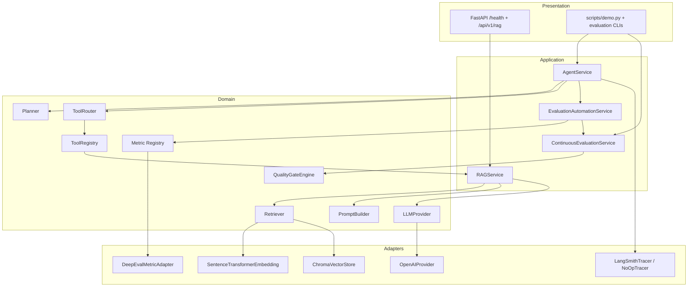
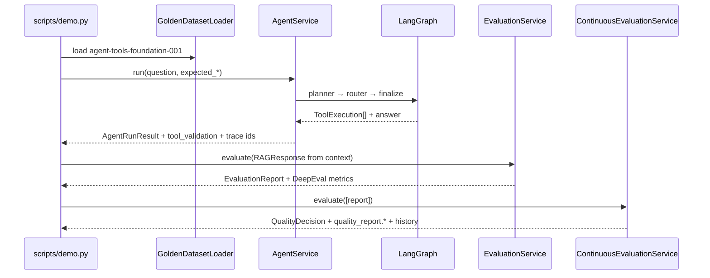
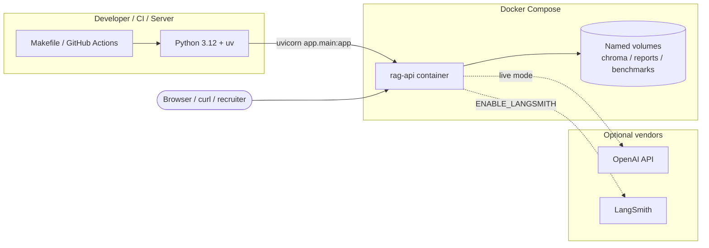
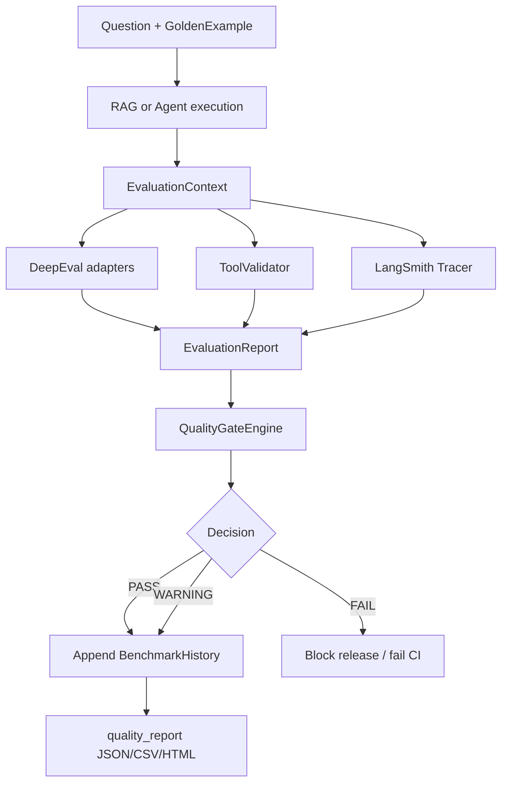
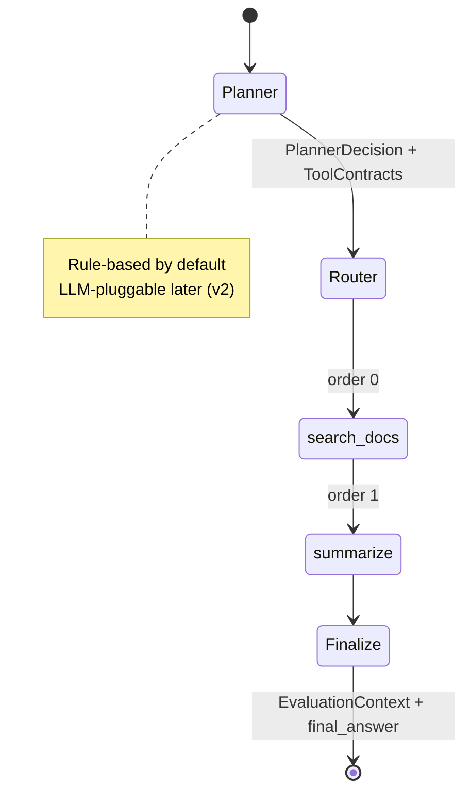
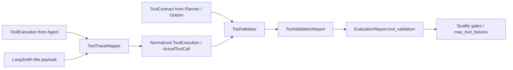

# Architecture Diagrams (v1.0)

Mermaid diagrams for interviews, README embeds, and onboarding.
Architecture is **frozen** at Version 1.0 — no MCP / Memory / Multi-Agent here.

## Component Diagram

## Sequence Diagram — Canonical Demo

## Deployment Diagram

## Evaluation Flow

## Agent Flow

## Tool Validation Flow

